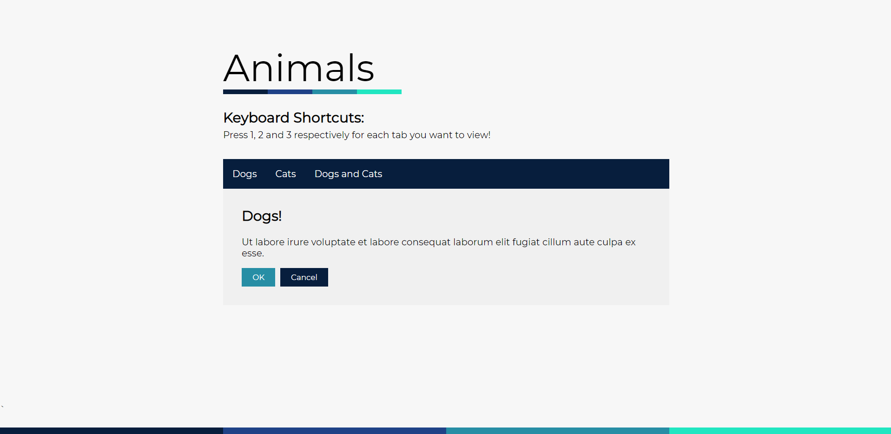

# Vue Transitions and Keyboard Shortcuts
Designing with custom underlines, a colour palette, and using Vue transitions. Also, used MousetrapJS for keyboard shortcuts for use in Vue!

There nothing more to it. Just wanted to learn more about Vue design animations. The keyboard shortcuts were a bonus!
The only reason I made this public is that I want to host this on Github Pages :)

